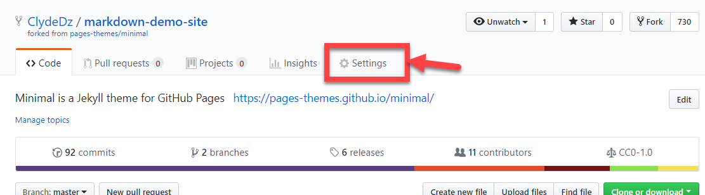
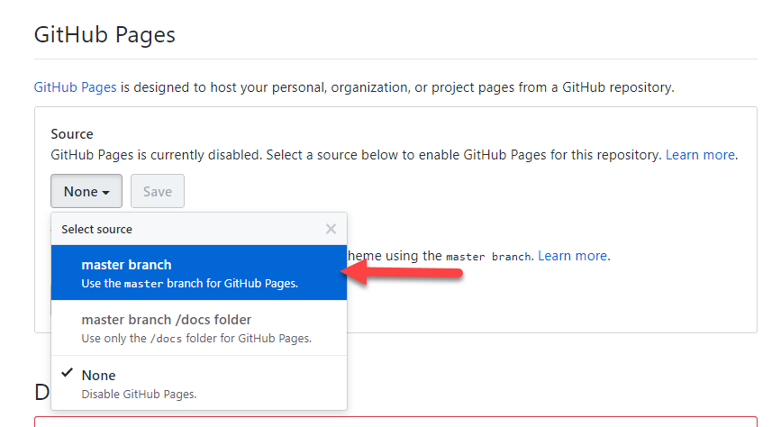
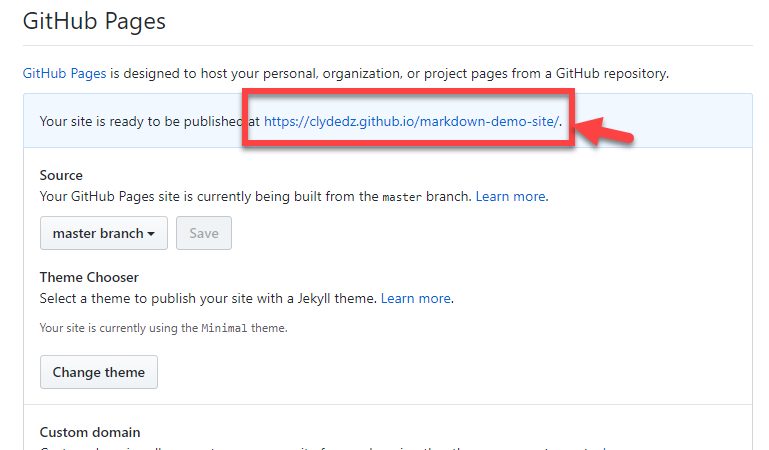
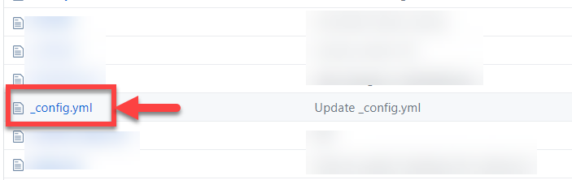
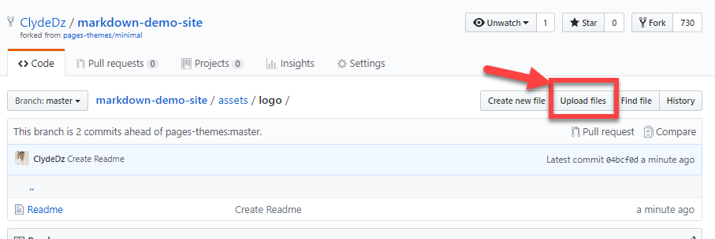

# Customizing this site

## Table of contents
+ [Making your site publicly visible](#making-your-site-publicly-visible)
+ [Configuration variables](#configuration-variables)
+ [Uploading files like images](#uploading-files-like-images)

### Making your site publicly visible
You want to be able to access this site via a URL so you can share your work! Follow along to update the settings.
1. Click on `settings` tab.

   
2. Scroll down to the `GitHub Pages` section. Select `master branch` from the source dropdown. Hit the `Save` button.

    
3. Scroll down again to the `GitHub Pages` section and you should see a URL with a confirmation message. 


### Configuration variables

1. Locate the `_config.yml` in the root directory.


2. Update the `title`, `logo` (URL), `description` to match the one-pager website you are intending to make.

```yml
title: Nikola Tesla
logo: https://upload.wikimedia.org/wikipedia/commons/thumb/d/d4/N.Tesla.JPG/184px-N.Tesla.JPG
description: A one-pager on the life of Nikola Tesla
show_downloads: false
google_analytics:
theme: jekyll-theme-minimal
```


### Uploading files like images
At any directory level, you should be able to see the `Upload files` button on your screen. Click that to start uploading files. 

> **Tip:** This is useful if you want to add images to your site. 


