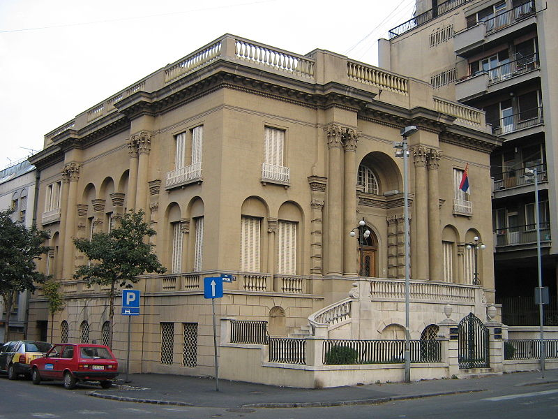

# Nikola Tesla

Nikola Tesla was an inventor, electrical engineer, mechanical engineer, and futurist who is best known for his contributions to the design of the modern `alternating current (AC) electricity supply system`.

Tesla conducted a range of experiments with mechanical oscillators/generators, electrical discharge tubes, and early X-ray imaging. Over 300 patents.

Tesla was born on the 10th of July 1856 in Smiljan, Austrian Empire (modern-day Croatia). Tesla died on the 7th of January 1943 at the age of 86 in New York City, United States.

| Key             | Value | 
|:----------------|---:|
| Born            | 10 July 1856 Modern-day Croatia                             |
| Died            | 7 January 1943 (aged 86) New York City, United States       |
| Resting place   | 	Nikola Tesla Museum, Belgrade, Serbia                     |
| Citizenship     | Austrian (1856–1891), American (1891–1943)                  |
| Best known for  |  Modern alternating current (AC) electricity supply system  |

## Early years

## Legacy and honors
- **Places**
  1. Belgrade Nikola Tesla Airport 
  1. Nikola Tesla Museum Archive in Belgrade 
  1. TPP Nikola Tesla, the largest power plant in Serbia
  1. 128 streets in Croatia had been named after Nikola Tesla as of November 2008, making him the eighth most common street name origin in the country
  1. Tesla, a 26 kilometer-wide crater on the far side of the moon 
  1. 2244 Tesla, a minor planet 
- **Memorials**
  1. The Nikola Tesla Memorial Centre in Smiljan, Croatia, opened in 2006.
    

## Credits
* Content paraphrased from [Nikola Tesla Wikipedia page][Wikipedia page].  
* Nikola Tesla picture sourced from [Wikimedia](https://commons.wikimedia.org/wiki/File:N.Tesla.JPG).  
* Nikola Tesla Museum image courtesy [By sr:Корисник:JustUser - sr:wiki]

[Wikipedia page]: https://en.wikipedia.org/wiki/Nikola_Tesla
[By sr:Корисник:JustUser - sr:wiki]: https://commons.wikimedia.org/w/index.php?curid=3090675
